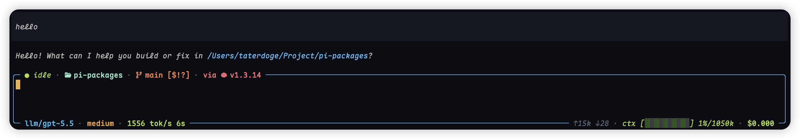
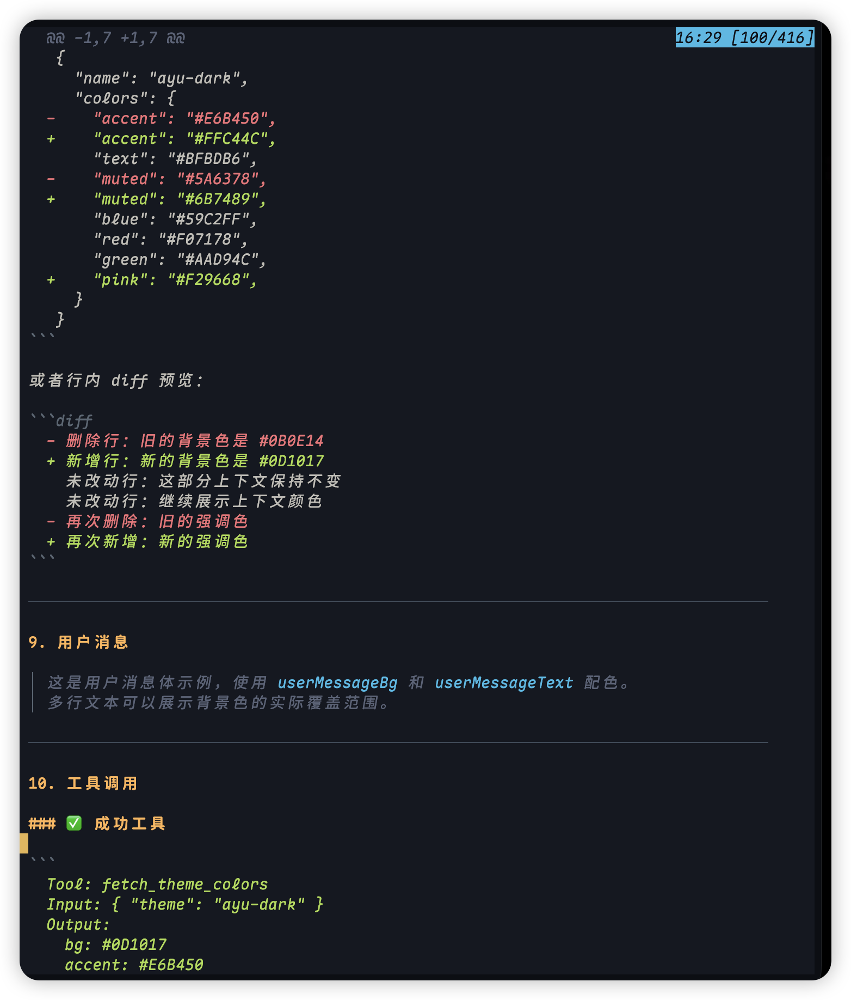
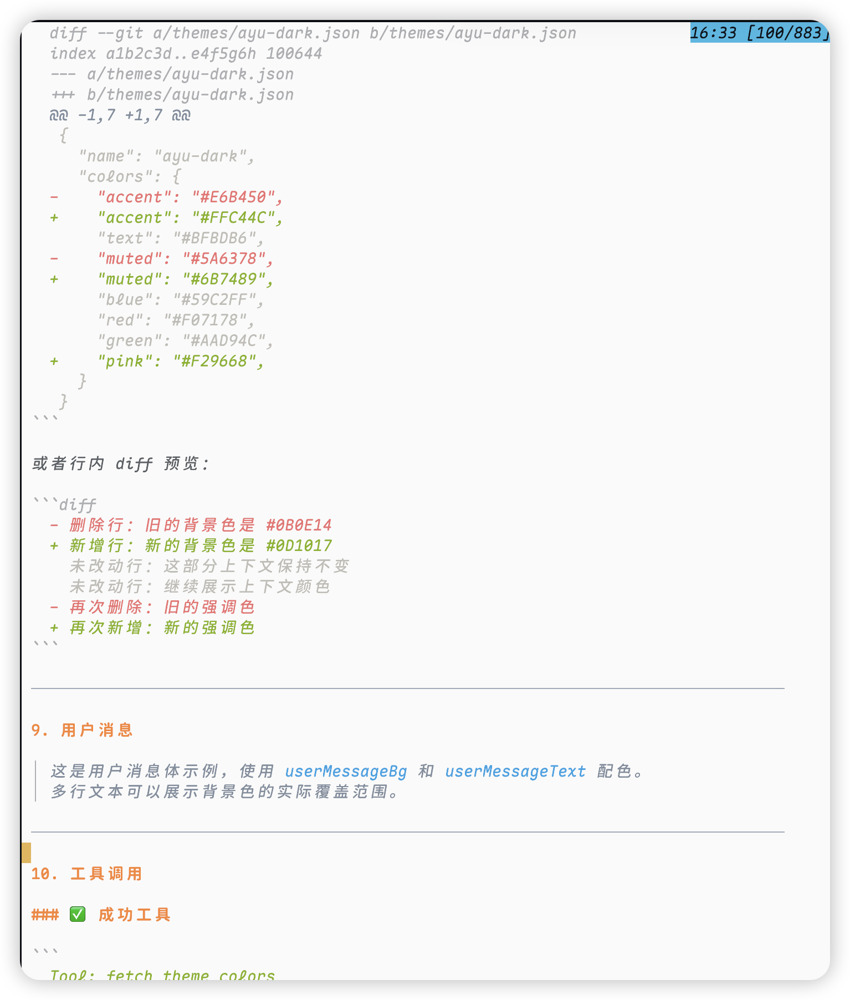

# 🎨 Pi Packages

[](https://www.npmjs.com/org/taterdoge) [](./LICENSE)

Theme and extension packages for the [Pi](https://pi.dev) coding agent. This Bun workspaces monorepo provides independently installable Pi packages for Ayu color themes, status bars, and more.

## 📦 Pi packages

Install only the packages you need. Each package is published under the `@taterdoge` npm scope and can be installed directly with `pi install npm:<package>`.

| Pi package | What it adds | Install |
| --- | --- | --- |
| [`@taterdoge/pi-ayu`](./packages/pi-ayu) | 🎨 Ayu-inspired dark and light color themes for the Pi terminal UI. | `pi install npm:@taterdoge/pi-ayu` |
| [`@taterdoge/pi-status`](./packages/pi-status) | 📊 Configurable live status bar as border decorations around the Editor. | `pi install npm:@taterdoge/pi-status` |

## 🚀 Quick start

Install a package from npm:

```bash
pi install npm:@taterdoge/pi-ayu
```

Try a package once without adding it permanently:

```bash
pi -e npm:@taterdoge/pi-ayu
```

Then select a theme via `/settings`.

## 🛠️ Package highlights

### 📊 Pi Status

Use [`@taterdoge/pi-status`](./packages/pi-status) to add a live status bar as border decorations around the Editor. Four configurable zones (top-left, top-right, bottom-left, bottom-right) show real-time segments for activity state, cwd, turn, active tool, git branch, runtime, model, thinking level, TPS, tokens, context window, and cost — all configurable via an interactive `/pi-status` menu.



### 🎨 Ayu themes

Use [`@taterdoge/pi-ayu`](./packages/pi-ayu) to bring the popular Ayu color scheme to your Pi terminal. Includes both `ayu-dark` (low-contrast dark surface with amber, blue, green, and coral accents) and `ayu-light` variants.

| ayu-dark | ayu-light |
|:---:|:---:|
|  |  |

## 🧑‍💻 Local development

Install dependencies from the repository root:

```bash
bun install
```

Run the full repository check:

```bash
bun run check
```

Try a package locally:

```bash
pi -e ./packages/pi-ayu
```

Or install from a local package path:

```bash
pi install ./packages/pi-ayu
```

Preview npm package contents before publishing:

```bash
npm pack --workspace @taterdoge/pi-ayu
```

## 🗂️ Repository structure

```txt
packages/
├── pi-ayu/
│   ├── assets/         # Preview screenshots
│   ├── themes/         # Theme JSON files
│   ├── LICENSE
│   ├── README.md
│   └── package.json
├── pi-status/
│   ├── assets/         # Preview screenshots
│   ├── src/            # Extension source (TS)
│   ├── LICENSE
│   ├── README.md
│   └── package.json
```

Each package contains its own `package.json`, `README.md`, `LICENSE`, and source assets. The root workspace handles shared linting, type-checking, and publishing scripts.

## ➕ Add a new package

1. Copy an existing package (e.g. `packages/pi-ayu`) to `packages/pi-your-package`
2. Rename the package, entry points, and tool names
3. Add a `pack:*` script in the root `package.json` if needed
4. Run `bun run check`

## 📄 License

MIT. See [`LICENSE`](./LICENSE).
