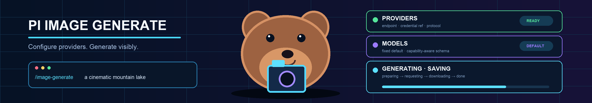

# @taterdoge/pi-image-generate

[](https://www.npmjs.com/package/@taterdoge/pi-image-generate) [](./LICENSE)

Skill-driven image generation and editing for Pi. You configure providers, protocols, and models; the package supplies one stable `image_generate` tool, immediate task status, safe image files, and a local browser settings page.



## Features

- Natural-language generation through the bundled `image-generate` skill
- `/image-generate <prompt>` shorthand and explicit `generate` form
- Generated images open in a browser tab for preview as soon as generation finishes
- Live `preparing`, `requesting`, `polling`, `downloading`, and `saving` status
- Local React, Tailwind CSS, and shadcn/ui settings page for provider/model/protocol CRUD
- Searchable provider `/models` discovery with checkbox multi-select and batch add
- Fixed default model; the tool never accepts a model override
- Generic OpenAI Images, Gemini generateContent, and configurable JSON task protocols
- Environment, directly stored API key/token, or Pi-auth credentials
- URL/base64 responses, reference images, cancellation, size limits, and atomic non-overwriting files

## Install

```shell
pi install npm:@taterdoge/pi-image-generate
```

Try locally:

```shell
pi -e ./packages/pi-image-generate
```

## Commands

```text
/image-generate <prompt>                    generate directly
/image-generate generate <prompt>           explicit generation form
/image-generate settings                    open local browser settings
/image-generate list [providers|models|protocols]
/image-generate status [task-id]
/image-generate reload
/image-generate help
```

The model is always `pi-image-generate.defaultModel`. Change it in `settings`, save, and the tool schema reloads immediately.

## Configuration

Settings are stored in a standalone `config.json` at `<agentDir>/extensions/pi-image-generate/config.json`. The browser editor is recommended; JSON examples below explain the wire formats.

`/image-generate settings` starts a temporary server bound only to `127.0.0.1`, opens a one-time authenticated browser session, and stops the server after Save, Cancel, or 10 minutes of inactivity. Literal credentials are masked in the browser and preserved unless explicitly replaced.

In Models, select an existing provider and choose **Fetch models**. The local settings server calls that provider's `GET /models` endpoint with the configured credential, normalizes OpenAI-style `data[]` and Gemini-style `models[]` responses, and returns only model metadata to the browser. Search the checklist, select models, and choose **Add selected**; manual model entry remains available.

### OpenAI Images-compatible

```json
{
  "pi-image-generate": {
    "version": 1,
    "defaultModel": "studio/flux",
    "outputDir": ".pi/images",
    "providers": {
      "studio": {
        "name": "Studio Gateway",
        "baseUrl": "https://gateway.example.com/v1",
        "protocol": "openai-images",
        "credential": { "source": "env", "value": "STUDIO_IMAGE_KEY" }
      }
    },
    "protocols": {},
    "models": {
      "studio/flux": {
        "provider": "studio",
        "id": "vendor/flux-model",
        "capabilities": {
          "imageInput": "multiple",
          "n": true,
          "size": true,
          "qualityValues": []
        },
        "protocolOverrides": {
          "editMode": "json",
          "referenceField": "reference_images",
          "imageFieldMode": "array"
        }
      }
    }
  }
}
```

For OpenAI-style multipart edits, use:

```json
{ "editMode": "multipart", "editPath": "images/edits" }
```

### Gemini generateContent-compatible

```json
{
  "pi-image-generate": {
    "version": 1,
    "defaultModel": "gemini/image",
    "outputDir": ".pi/images",
    "providers": {
      "gemini": {
        "baseUrl": "https://generativelanguage.googleapis.com/v1beta",
        "protocol": "gemini-generate-content",
        "credential": { "source": "env", "value": "GEMINI_API_KEY" }
      }
    },
    "protocols": {},
    "models": {
      "gemini/image": {
        "provider": "gemini",
        "id": "your-image-model-id",
        "capabilities": {
          "imageInput": "multiple",
          "n": true,
          "size": false,
          "qualityValues": []
        }
      }
    }
  }
}
```

### Generic asynchronous JSON

```json
{
  "pi-image-generate": {
    "version": 1,
    "defaultModel": "queue/flux",
    "outputDir": ".pi/images",
    "providers": {
      "queue": {
        "baseUrl": "https://queue.example.com/v1",
        "protocol": "queue-v1",
        "credential": { "source": "literal", "value": "your-api-key" }
      }
    },
    "protocols": {
      "queue-v1": {
        "type": "generic-json",
        "request": {
          "url": "jobs",
          "body": { "model": "{model}", "prompt": "{prompt}", "n": "{n}" }
        },
        "poll": {
          "request": { "method": "GET", "url": "jobs/{taskId}" },
          "taskIdPath": "id",
          "statusPath": "status",
          "successStatuses": ["succeeded"],
          "failureStatuses": ["failed", "cancelled"],
          "resultRequest": { "method": "GET", "url": "jobs/{taskId}/result" }
        },
        "response": { "imagePaths": ["images.*.url"] }
      }
    },
    "models": {
      "queue/flux": {
        "provider": "queue",
        "id": "flux",
        "capabilities": {
          "imageInput": "none",
          "n": true,
          "size": true,
          "qualityValues": []
        }
      }
    }
  }
}
```

These are examples, not built-in presets. Use the endpoint, model id, credential source, and parameter mappings documented by your service.

## Credential sources

```json
{ "source": "env", "value": "IMAGE_API_KEY" }
{ "source": "literal", "value": "your-api-key" }
{ "source": "pi-auth" }
```

`literal` values are stored as plain text in the extension `config.json`; prefer `env` or Pi auth on shared machines. Custom secret headers use the same reference shape. `/image-generate list` only displays source/status, never values.

## Tool

`image_generate` accepts:

- `prompt`
- optional `image` paths/URLs when supported
- optional `n`, `size`, and constrained `quality` when supported by the fixed model
- optional `filename` and `outputDir`

It never accepts `model`, provider, endpoint, headers, or API keys.

## Output and safety

- Default output directory: `<cwd>/.pi/images`
- Tool and command results open a temporary local HTML preview in the default browser and report every saved file path
- Existing files are never overwritten (`hero.png`, `hero-v2.png`, ...)
- Raw base64/data URI tool inputs are rejected; use a path or HTTP(S) URL
- Provider response bodies, credentials, prompts, and signed URL queries are excluded from logs and task history
- User-configured private/local endpoints are allowed; configure only services you trust

## Development

```shell
bun test packages/pi-image-generate/test
bun run --cwd packages/pi-image-generate build:web
bun run check
npm pack --workspace @taterdoge/pi-image-generate
```
